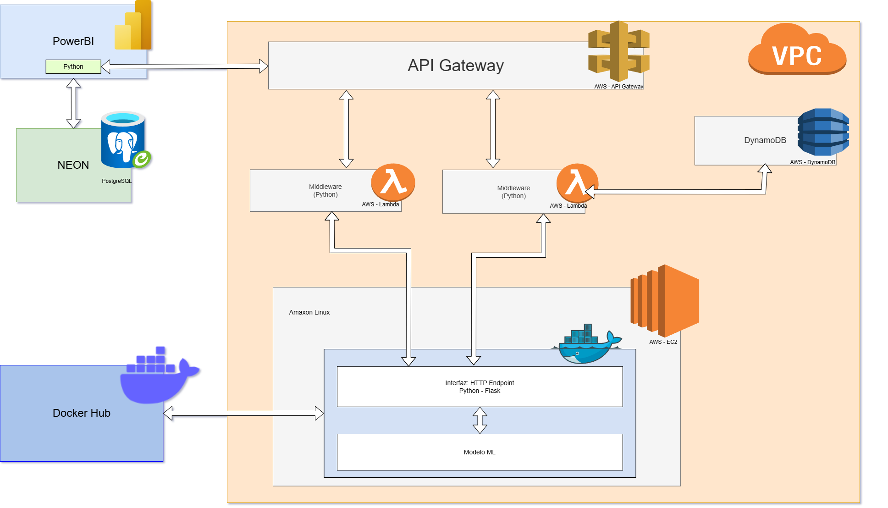

# Proyecto TFM: Predictor de Precios de Viviendas en Castilla y León con Machine Learning

Predicción para decisiones informadas en el mercado inmobiliario de Castilla y León (España).

## Descripción
Este proyecto tiene como objetivo predecir el precio de venta de viviendas en la comunidad autónoma de Castilla y León mediante el uso de técnicas de Machine Learning. La predicción precisa del precio de las propiedades es de gran importancia para el mercado inmobiliario local, ya que puede ayudar a compradores, vendedores, agencias y entidades financieras a tomar decisiones más informadas.

Para lograr este objetivo, se ha desarrollado un flujo de trabajo completo que abarca desde la recolección y limpieza de los datos hasta la construcción, evaluación y comparación de modelos de predicción. El proceso completo se encuentra dividido en notebooks, que conforman el pipeline de procesamiento de datos (ETL) y modelado.

## Características / Funcionalidades

Predicción de precios de viviendas en la comunidad autónoma de Castilla y León.
- Modelo de machine learning entrenado específicamente con datos inmobiliarios de la región para asegurar una mayor precisión.
- Proceso completo de ETL (Extracción, Transformación y Carga) aplicado a datos reales.
- Análisis exploratorio y visualización de los datos para comprender mejor las variables que influyen en el precio.
- Comparación entre distintos algoritmos de regresión para seleccionar el modelo más eficaz.
- Pipeline reproducible dividido en notebooks bien documentados.

##  Despliegue y Uso del Modelo

Se ha preparado un conjunto de datos limpio y estructurado que sirve como entrada para una API desplegada en AWS. En esta API se han integrado dos modelos entrenados y validados durante el proceso de exploración:
- **XGBoost**: Modelo basado en árboles de decisión, optimizado para alto rendimiento.
- **Red Neuronal Artificial (ANN)**: Modelo de aprendizaje profundo, útil para captar relaciones no lineales complejas.

La API permite realizar predicciones en tiempo real a partir de nuevos datos de viviendas, facilitando la integración en entornos externos.

A continuación, se muestra un diagrama que ilustra la arquitectura de implementación del proyecto:



Se ha conectado Microsoft Power BI a la API de AWS, permitiendo:
- La creación de paneles dinámicos e interactivos.
- La visualización del proceso de predicción de precios.

## Estructura del Proyecto 

```bash                 
├── 00_Conexion_BBDD.ipynb                  # Conexión a la base de datos desde notebooks
├── 01_datos_viviendas_CyL.ipynb            # Limpieza inicial del dataset principal
├── 02_datos_municipios_Zamora.ipynb        # Procesamiento de municipios de Zamora
├── 03_datos_municipios.ipynb               # Procesamiento de todos los municipios de CyL
├── 04_EDA.ipynb                            # Análisis exploratorio de datos
├── 05_Machine_Learning.ipynb               # Entrenamiento y evaluación de modelos ML
├── 05.5_prueba_XGB_exportado.ipynb         # Carga y prueba del modelo XGBoost exportado
├── 06_ANN.ipynb                            # Entrenamiento de red neuronal artificial (ANN)
├── 06.5_prueba_ANN_exportado.ipynb         # Evaluación del modelo ANN exportado
├── 07_carga_datos_S3.ipynb                 # Carga de datos a AWS S3
├── 07.5_carga_datos_api.ipynb              # Envío de datos a API para conexión con Power BI
├── conexion.py                             # Script auxiliar de conexión a la BBDD
├── imagenes/                               # Carpeta de imágenes usadas en el README o informes
│   ├── carga docker.png
│   ├── carga S3.png
│   ├── Correlacion.png
│   └── prediccion_xgb.png
├── mapas/                                  # Mapas interactivos generados en el proyecto
│   ├── mapa_interactivo_castilla_leon.html
│   └── mapa_interactivo_fast.html
├── modelos_exportados/                     # API y modelos listos para despliegue
│   ├── app.py
│   ├── Dockerfile
│   ├── prueba_app.py
│   ├── requirements.txt
│   ├── .dockerignore
│   ├── modelo_ann/
│   └── modelo_ml/
├── raw_data/                               # Datos originales y auxiliares
│   ├── DatosViviendasCyL.csv
│   ├── edades_cyl.xlsx
│   ├── municipios/
│   └── provincias/
├── sqls/                                   # Scripts SQL usados en el proyecto
│   ├── comodidades.sql
│   └── dim_propiedades_api.sql
├── visualizacion/                          # Archivos de visualización (Power BI, imágenes institucionales)
│   ├── Identificador+Junta+color.jpg
│   └── visualizacion_tfm.pbix
├── .env                                    # Variables de entorno (no compartido por seguridad)
├── requirements.txt                        # Dependencias del proyecto
├── indicadores.json                        # Indicadores clave del proyecto
├── DatosVivendas1.csv                      # CSV inicial para la carga de datos
└── README.md                               # Este archivo
```

### Estructura y Contenido de los Notebooks

El proyecto está organizado en una serie de notebooks que guían al lector a través del proceso completo, desde la conexión a la base de datos hasta la implementación de modelos de machine learning y su despliegue. A continuación, se detalla el propósito de cada notebook:

1. **00_Conexion_BBDD.ipynb**  
   Establece la conexión con la base de datos utilizando las credenciales proporcionadas en el archivo `.env`. Este paso es fundamental para la carga y almacenamiento de datos en el sistema.

2. **01_datos_viviendas_CyL.ipynb**  
   Carga y realiza una limpieza inicial del conjunto de datos principal (`DatosViviendas1.csv`) que contiene información sobre viviendas en Castilla y León.

3. **02_datos_municipios_Zamora.ipynb**  
   Procesa y enriquece los datos específicos de los municipios de Zamora, añadiendo variables relevantes para el análisis.

4. **03_datos_municipios.ipynb**  
   Integra y normaliza los datos de todos los municipios de Castilla y León, asegurando una estructura coherente para el análisis posterior.

5. **04_EDA.ipynb**  
   Realiza un Análisis Exploratorio de Datos (EDA), incluyendo visualizaciones y estadísticas descriptivas para identificar patrones y relaciones en los datos.

6. **05_Machine_Learning.ipynb**  
   Implementa y evalúa varios modelos de machine learning, como regresión lineal, Random Forest y XGBoost, para predecir los precios de las viviendas.

7. **05.5_prueba_XGB_exportado.ipynb**  
   Prueba el modelo XGBoost previamente entrenado y exportado en la carpeta /modelos_exportados, evaluando su rendimiento en nuevos conjuntos de datos.

8. **06_ANN.ipynb**  
   Desarrolla una Red Neuronal Artificial (ANN) utilizando TensorFlow/Keras, incluyendo la preparación de datos, arquitectura del modelo y entrenamiento.

9. **06.5_prueba_ANN_exportado.ipynb**  
   Evalúa el modelo de ANN exportado en la carpeta /modelos_exportados, analizando su capacidad predictiva y comparándola con otros modelos.

10. **07_carga_datos_S3.ipynb**  
    Carga los datos procesados en un bucket de Amazon S3, facilitando su acceso para aplicaciones desplegadas en la nube.

11. **07.5_carga_datos_api.ipynb**  
    Prepara y envía los datos a través de una API desplegada en AWS, permitiendo la integración con herramientas como Power BI para visualización y análisis en tiempo real.

Cada notebook está diseñado para ser ejecutado en orden, asegurando un flujo de trabajo coherente y reproducible desde la adquisición de datos hasta la implementación de modelos predictivos y su integración en aplicaciones prácticas.

## Instalación

1. Clona este repositorio:
```bash
   git clone https://github.com/Hulkilla/Machine-Learning-Real-State-Predictor-TFM.git
```
2. Navega al directorio del proyecto:
```bash
   cd Machine-Learning-Real-State-Predictor-TFM
```
3. Crea un entorno virtual e instala las dependencias
```bash
   python -m venv venv
   source venv/bin/activate
   pip install -r requirements.txt
```
4. Descarga el dataset inicial:

El archivo de datos original DatosViviendas1.csv está disponible en el siguiente enlace: [DatosViviendas1.csv](https://drive.google.com/file/d/11I9xDDU9CAdzZ_MZ3q8uthY8ePF7yqGn/view?usp=drive_link)

Colócalo en el directorio principal, donde se encuentran los Jupyter Notebooks.

5. Configura las variables de entorno:

Es necesario un archivo .env para definir la conexión con la base de datos. Debe incluir las siguientes variables:

```bash
user = 'tu_usuario'
password = 'tu_contraseña'
host = 'localhost' 
port = '5432'
dbname = 'nombre_base_datos'

```

Coloca este archivo .env en el mismo directorio que los notebooks.

6. Crea la base de datos y las tablas necesarias:

Los notebooks están diseñados para crear automáticamente las tablas al ejecutarse, siempre que exista una conexión válida definida en el .env. 

Ejecuta los notebooks en orden para reproducir el flujo completo, desde la limpieza de datos hasta la predicción de precios.

Las tablas se generan directamente en la base de datos cuando se ejecutan los notebooks.


## Tecnologías y Librerías Utilizadas

### Python 3.12.10 – Entorno principal de desarrollo
- **Manipulación de datos**:  
  `pandas`, `numpy`

- **Visualización de datos**:  
  `matplotlib`, `seaborn`, `folium` (mapas interactivos), `FastMarkerCluster` (visualización masiva de puntos)

- **Estadística**:  
  `statsmodels`

- **Machine Learning y Modelado**:
  - Modelos clásicos: `scikit-learn` (Linear Regression, Decision Tree, Random Forest, KNN, SVR, Gradient Boosting, etc.)
  - Ensembling avanzado: `BaggingRegressor`, `VotingRegressor`, `StackingRegressor`
  - Modelos optimizados: `XGBoost`
  - Escalado y selección de características: `StandardScaler`, `VarianceThreshold`, `GridSearchCV`

- **Persistencia de modelos**:  
  `joblib`

### Base de Datos
- **PostgreSQL**: Gestión de la base de datos relacional
- **Python dotenv**: Gestión segura de credenciales con `.env`
- **Scripts personalizados**: `conexion.py` con funciones auxiliares para conectar, evaluar y visualizar modelos

### Visualización geoespacial
- **Folium**: Creación de mapas interactivos en HTML
- **FastMarkerCluster**: Renderizado eficiente de miles de puntos en mapas
- **OSMnx**: Descarga y visualización de datos de OpenStreetMap

### Infraestructura y Despliegue
- **Amazon Web Services (AWS)**:  
  - S3 (almacenamiento de datos)
  - API Gateway + Lambda para predicción vía API
- **Docker**: Contenerización de la API de predicción

### Visualización y Reporting
- **Microsoft Power BI**: Visualización conectada en tiempo real a la API para mostrar resultados dinámicos


## Casos de Uso / Aplicaciones Prácticas

- **Valoración automatizada de inmuebles**: Agencias inmobiliarias pueden utilizar el modelo para estimar precios de mercado de propiedades de forma rápida y objetiva.
- **Análisis de mercado**: Consultoras o administraciones públicas pueden analizar tendencias de precios en Castilla y León con base en variables clave.
- **Asistencia a compradores y vendedores**: Usuarios individuales pueden acceder a estimaciones realistas antes de tomar decisiones de compra o venta.
- **Integración en plataformas web**: La API desplegada en AWS permite incorporar el modelo en aplicaciones o portales inmobiliarios.
- **Visualización ejecutiva**: El dashboard en Power BI facilita la presentación de resultados a perfiles no técnicos y la toma de decisiones estratégicas.

## Licencia

Este proyecto está bajo la Licencia Creative Commons [Reconocimiento-NoComercial-SinObraDerivada 3.0 España (CC BY-NC-ND 3.0 ES)](https://creativecommons.org/licenses/by-nc-nd/3.0/es/).

Puedes consultar el texto completo de la licencia en el archivo `LICENSE` incluido en este repositorio.

## Estado del proyecto

Este proyecto se ha desarrollado como Trabajo Final de Máster y se considera completado en su alcance inicial. Las actualizaciones futuras dependerán de la disponibilidad y el interés en seguir mejorándolo.

## Descargo de Responsabilidad

Este proyecto ha sido desarrollado con fines académicos como Trabajo Final de Máster. Las predicciones y análisis proporcionados deben considerarse estimaciones y no constituyen asesoramiento financiero o inmobiliario profesional. El autor no se hace responsable del uso que se le pueda dar a esta herramienta.

## Cómo Contribuir

Si encuentras algún error, tienes sugerencias para mejorar el proyecto o quieres contribuir, por favor:
1. Abre un *issue* describiendo el error o la sugerencia.
2. Si deseas implementar una mejora, haz un *fork* del repositorio y envía un *pull request* con tus cambios.

## Agradecimientos

Quisiera expresar mi más sincero agradecimiento a las siguientes personas e instituciones por su invaluable apoyo en el desarrollo de este Trabajo Final de Máster:

- **Jorge Segura Gisbert** (*jseguragi@uoc.edu*): Por proporcionarme la oportunidad de desarrollar este proyecto bajo su supervisión y por facilitar el acceso al dataset DatosViviendas1.csv, fundamental para la realización de este trabajo. Su guía y conocimientos fueron esenciales.
- **Universitat Oberta de Catalunya (UOC)**: Por brindar el marco académico y los recursos necesarios para la realización de este Trabajo Final de Máster.

## Contacto

Puedes contactarme para cualquier duda o comentario sobre este proyecto a través de:
* Correo electrónico: marinafd1993@gmail.com
* LinkedIn: [Marina Fernández Delgado, PhD](https://www.linkedin.com/in/mfd-122567b2/)